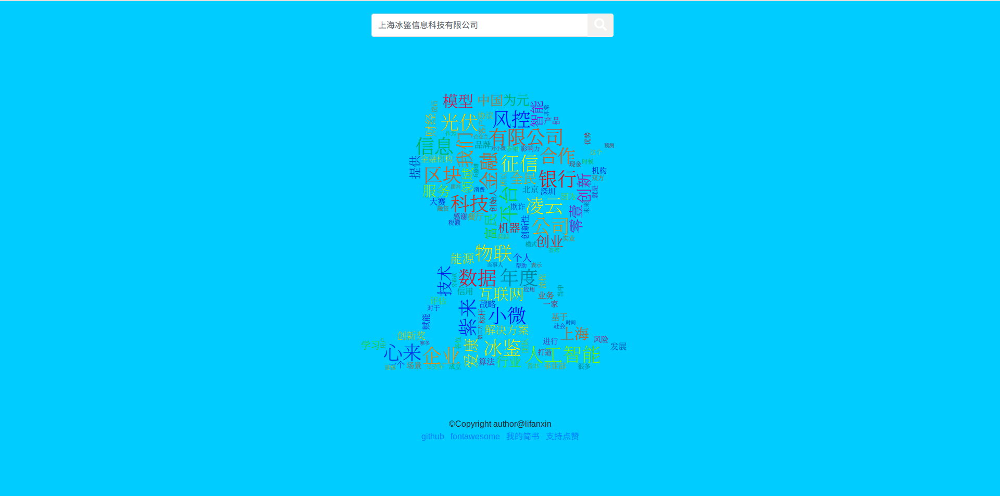
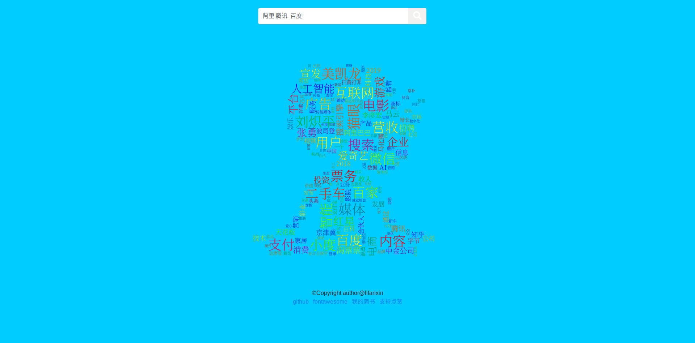
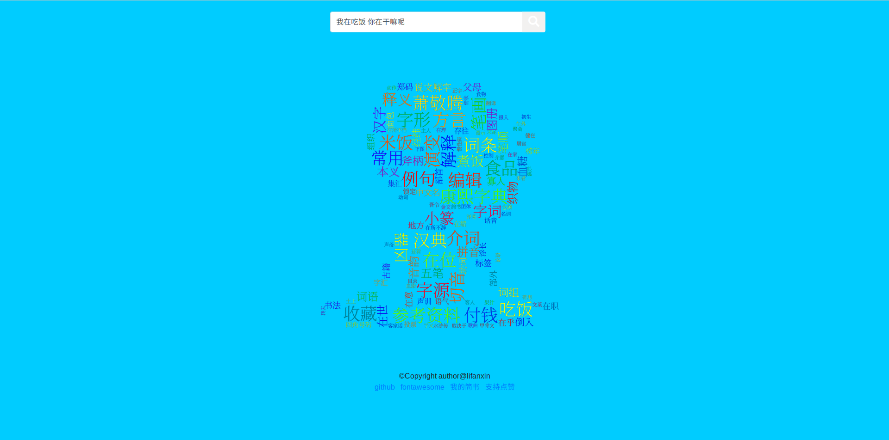

# [yuntu | 云图](http://119.3.111.11)
create beautiful wordcloud image online

## 网站功能介绍
&emsp;&emsp;分析处理用户输入的关键词或句子，从数据库中或者网络上获取最新的相关数据然后进行分词，统计词频，按词频数大小从高到低生成词云图，展示给搜索用户。  

## 三大步流程示意

* index.html-起始页，负责获取用户输入。
* python后台分析用户输入，返回关键字词云图。
* show.html-展示页面，展示词云图

## 详细过程梳理
### 用户输入
&emsp;&emsp;***对输入过滤和清洗***  
&emsp;&emsp;去除特殊字符、标点符号和输入字符串两端的空格，但不去除用户输入中间空格，以便帮助后台准确分析关键词。

&emsp;&emsp;***处理输入内容长度***  
&emsp;&emsp;在已经清洗的基础上对输入长度进行判断，保留最多225长度的用户输入。输入内容长度会影响网站响应速度。

### 处理输入
&emsp;&emsp;***重新提取关键词***  
&emsp;&emsp;字符串大于10采取提取关键词的方法；小于10则进行分词（采用搜索引擎模式，尽可能获得更多的搜索猜想）。

### 获取数据
&emsp;&emsp;***检索数据库***  
&emsp;&emsp;查询之前已经准备好的文本信息数据库（主要爬取对象为[网络公司](yuntu/auto_spiders/company/company.txt)，信息来源为各大新闻媒体平台，包括头条、新浪、凤凰资讯、人民网、新华网等，存储对象是新闻文本信息）。  
&emsp;&emsp;***实时网络爬取***  
&emsp;&emsp;如果数据库中不包含已有信息，那么采用在线网络爬取的方式，主要爬取对象为百科、Wiki等，获取文本信息。

### 处理数据
&emsp;&emsp;***jieba***  
&emsp;&emsp;采用jieba进行中文分词和词频统计。

### 生成词云图
&emsp;&emsp;***wordcloud***  
&emsp;&emsp;采用wordcloud生成词云图。

## 关于其它
### 前端
&emsp;&emsp;***bootstrap***  
&emsp;&emsp;利用框架bootstrap来快速进行网页前端的设计和开发。

### 模板
&emsp;&emsp;***jinja2***  
&emsp;&emsp;采用jinja2搭配bootstrap，可以更快速的处理一些简单的事件流程。  

### 后端  
&emsp;&emsp;***flask***  
&emsp;&emsp;利用python后端轻量级框架flask，快速构建后端程序，同时搭配jinja2模板实现简单的逻辑处理。

## 项目展示
### 首页

### 搜索公司（单个）

### 搜索公司（多个）

### 搜索句子

## 待处理问题
### 网站响应速度
&emsp;&emsp;***服务器性能瓶颈***  
&emsp;&emsp;一分钱一分货，服务器能跑已经很不错了。

&emsp;&emsp;***数据库检索速度***  
&emsp;&emsp;还未进行优化，但本身采用数据库已经减少了实时网络爬取造成的延迟。  

&emsp;&emsp;***实时爬取速度***  
&emsp;&emsp;如果数据库未能hit，这里耗时比较长，要占整个响应时间的一半。需要优化！！！

&emsp;&emsp;***词云生成速度***  
&emsp;&emsp;这里耗时占了另外一半时间，并且随着采用的词汇越多，图越大，生成的速度越慢。需要找到适中的处理！！！有时间可以自己编写前端生成的工具。  

### 实时爬取目前只支持中文搜索

## 还有一些其它问题
&emsp;&emsp;***寻找一种适合中英文的字体且好看？***  
&emsp;&emsp;***寻找一些适合mask的图片且好看？***  
&emsp;&emsp;***寻找一种好看的网页设计且耐用？***  
